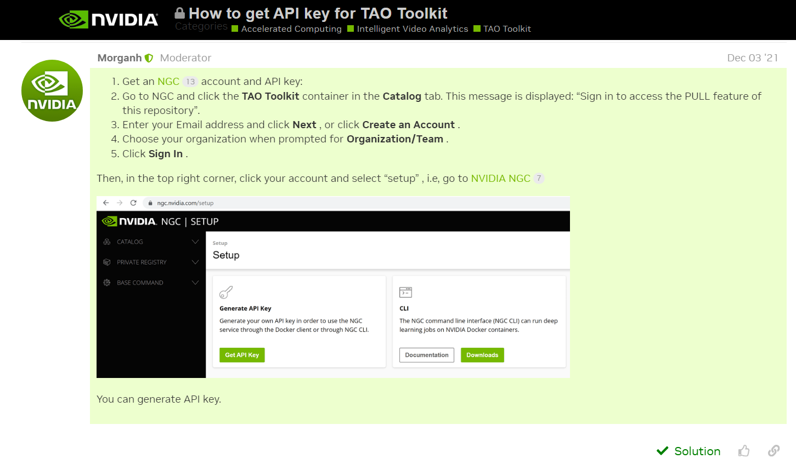
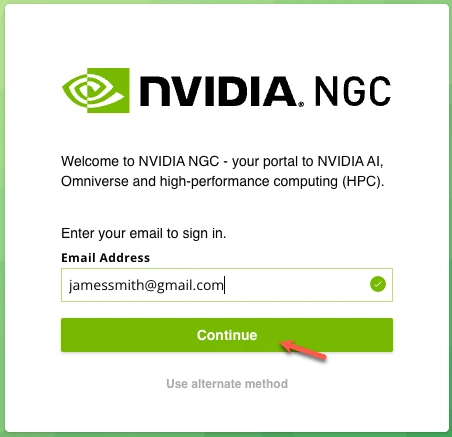
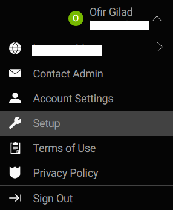
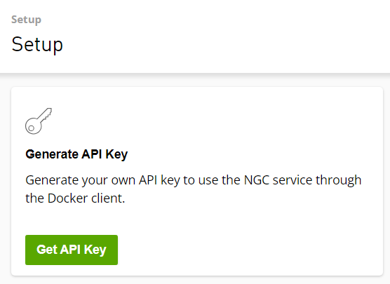
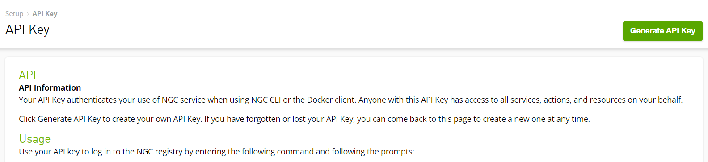
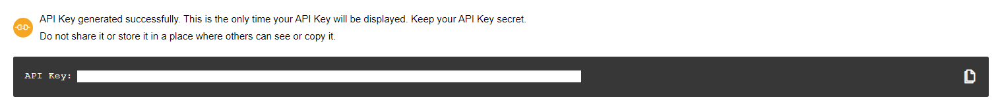
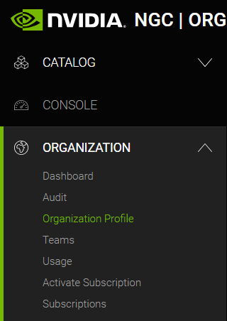
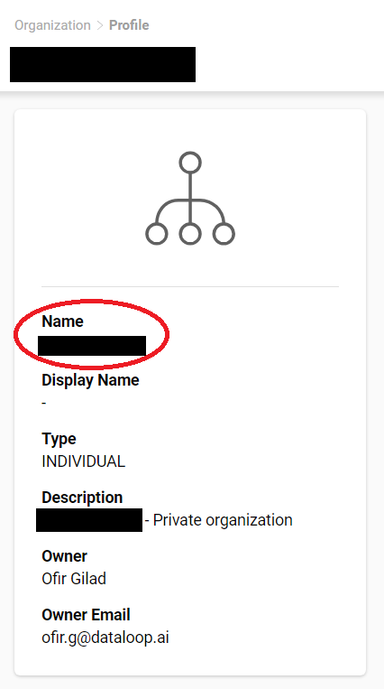

# How to get API key and ORG for TAO Toolkit

## Guide from NVIDIA forums:

## Detailed guide:

1. Sign up for NVIDIA NGC: https://ngc.nvidia.com/signin

2. Click on your profile Icon and select Setup: https://ngc.nvidia.com/setup

3. Click on Get API Key: https://ngc.nvidia.com/setup/api-key

4. Click on Generate API Key:

5. On the bottom of the page you will see the API Key:

6. Go to your Organization Profile: https://org.ngc.nvidia.com/profile

7. Copy your ORG name:

8. In Dataloop platform add the Api Key and Org as 2 secrets:

